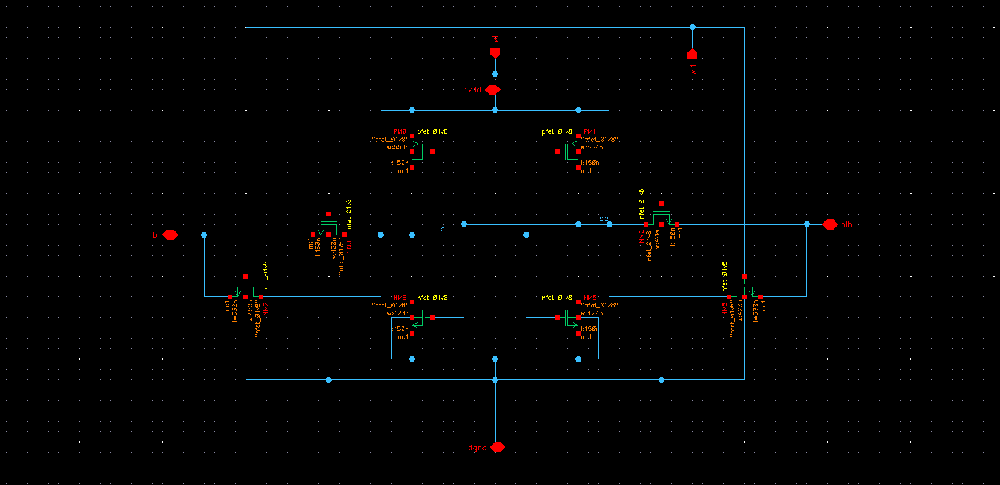
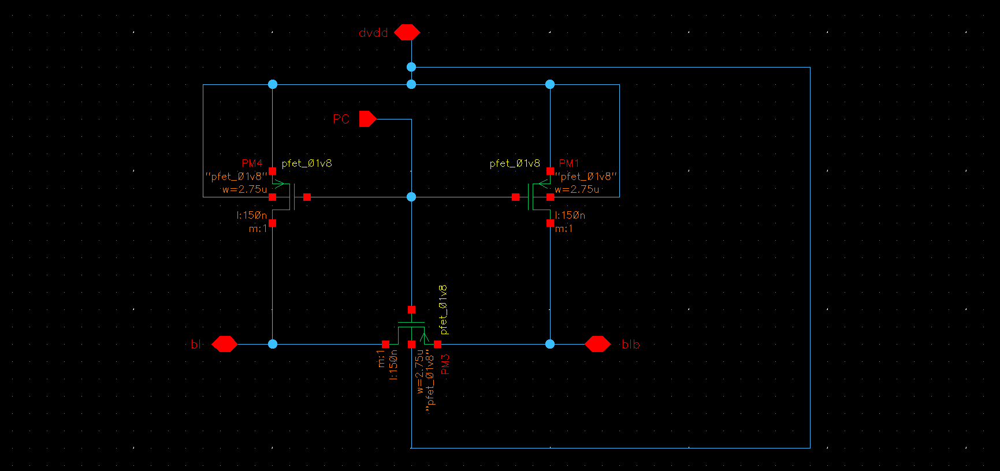
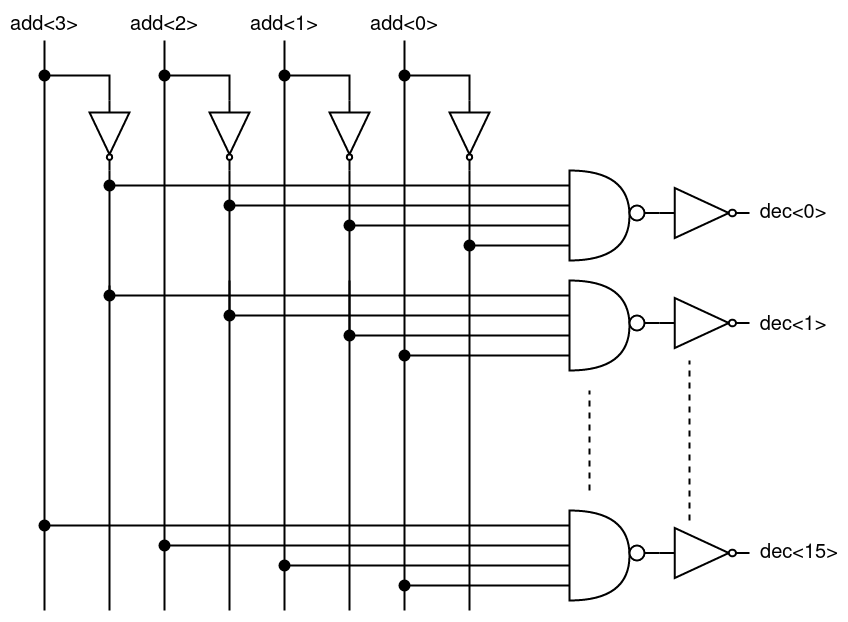
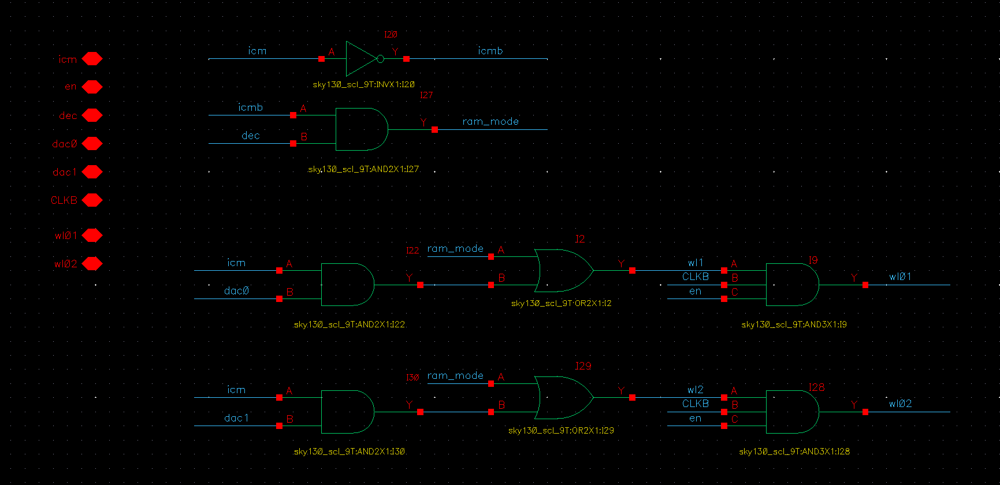
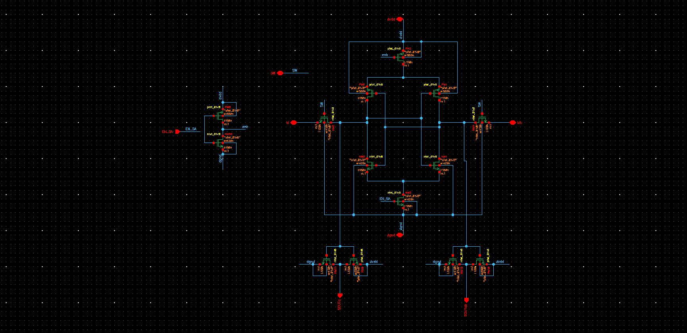

# 16 byte SRAM USING CMOS

- Designed a 16-byte SRAM (Static Random Access Memory) using the 130nm technology node, employing a full custom approach.
- This SRAM design allows for reading or writing 8-bit data at a time.
- Throughout the project, various Cadence tools were employed to aid in the design and verification processes.

## Table of Contents

- [Introduction](#Introduction)
- [Architecture](#Architecture)
- [Components](#Components)
    - [8T_SRAM](#8T_SRAM)
    - [Precharge_circuit](#Precharge_circuit)
    - [Row_decoder](#Row_decoder)
    - [RAM/ICM logic block](#RAM-ICM-logic-block)
    - [Sense_Amplifier](#Sense_Amplifier)
    - [Write_driver](#Write_driver)
 
- [Design and testbench](#Design_and_testbench)
- [Layout](#Layout)
- [Conclusion](#Conclusion)
 ## Introduction
  ### SRAM :  

Static Random Access Memory, commonly known as SRAM, is a fundamental type of semiconductor memory used extensively in modern digital electronic systems. Unlike dynamic RAM (DRAM), which requires periodic refreshing, SRAM is static in nature, meaning it holds data as long as power is supplied.

Applications of SRAM include serving as cache memory in microprocessors, providing high-speed storage for critical data and instructions, and acting as the primary memory in various embedded systems where fast and reliable access to data is essential. SRAM is favored for its fast read and write access times, making it a crucial component in optimizing the performance of various electronic devices.
## Architecture
- In this section we will see the architecture integrates a 16×8 SRAM array, a dual-mode RAM/ICM logic controller, and key peripheral circuits—decoder, sense amplifier, precharge, and write driver— offering a compact, energy-efficient solution for future embedded memory systems. Then we will discuss about the overall operation of this system which will give the rough idea about the working of various components simultaneously and how the data is being stored and then how we read that from SRAM cell.

 Figure 1: Architecture_SRAM

- Figure 1 respresents the the architecture of the 16 byte SRAM along with some supporting elements like precharge circuit, write driver etc.
- We can read or write 8 byte data in the memory element and the total amount of memeory avaliable is 16 byte.
- The design of 16 byte SRAM is done by arranging the **6T SRAM cells** as 16 row and in ach row there will be 8 cells
   for each row there will a word line (WL) and for each colum there will a BL and BLB so in total there will be 16 WL and 8 BL and BLB.
- 6T SRAM cells are designed using a back to back inverter and two access transistors, the design part will be discussed 
  #### Operation

  - All the signals that are shown in the figure 1 are given parallely.
  
  - First PC will be given zero that will activate the precharge circuit the precharge circuit will basically chagrge the capacitors Cpar to vdd then if we want to write then PC will be high and ctrl signal will be turned ON 
 and rwn will be given as 0, by doing this the write driver will be actiavted and after that it will drive the data from input to the BL and BLB node. The adress data will be taken by the row decoder 
 and row decoder will select in which row to write.  Suppose the adress is 0000 then it will select the 0th  row for writing then when the control signal will be turned ON it will activate the WL signal 
 then the data will be written to SRAM and all these things will occur when the precharge signal is at high.A point to note is before each read or write there will be a precharge and when precharge is done after that only read or write operation can   be started. Now becuase of back to back inverters it will hold the data till the time the next data is not written in the same location.

   - Then if we want to read again we have to precharge and the BL and BLB node to vdd that means Cpar is fully charged. Then when pc = 0 and WL = 1 at that time the the data stored in the sram is 1 then the BLB
  node will come down and if the data stored in sram is 0 then the BL node will come down i.e the Cpar in the BL side wll discharge.Now the sense Amplifier two inputs are also connected to the BL and BLB line
  when any one node will go down it will sense the voltage difference between BL and BLB node and at the sense amplifier output we will get the data of sram that we have selected by giving its adress.

## Components

In this section, Various components of projects are explained in detail and realted equations, simulation results are mentioned.  

### 6T_SRAM

<figure>
    
</figure>

&nbsp;Figure 4: 6T SRAM

 The above fingure i.e figure 4 shows the classic structure of a 6T sram which can store one bit data.
- These are basically two back to back inverter with access transistor i.e M3 and M4.
- Since there are two back to back inverter structure is there till the time the vdd and ground supply is there for inverter the data will not change.

#### Operation :
- There are basically 3 modes of opeartion,
     - read operation
     - write operation
     - hold operation
- In read and write operation WL (Word line) = 1 and in hold operation WL = 0.
- Word line will be controlled by a signal called control and row decoder output, which will be discussed later.
- read write operation will be controlled by  signal rwn and  control as shown in figure 1 i.e SRAM architecture.

##### Read operation :
- In read operation first the bit line (BL) and bit line bar (BLB) node will be charged to vdd.
- Then PC=1 i.e Precharge will be turned OFF, in figure 4 suppose node N1 is at vdd and N2 is at zero i.e we can say that we have stored a logic 1 in sram cell previously.
- When we will make WL = 1 then, 
  BL node is at vdd and N1 is at also at vdd then there will be no change in BL where as BLB node is at vdd but N2 is at logic 0 and M2 is also ON as N1 is input for M2 because of back to back structure
  hence BLB node will try to discharge i.e the Parasitic Cap at BLB node Cpar will discharge through that path of M2 and M4.
- In this way BL node is stable and BLB node is going down which is a indication that we are reading logic 1 similarly while reading logic 0 BLB node will be stable at logic 1 where as BL node will be  dischagred gradually.
- During read operation there is a problem that we can face that is :
   - While reading logic 0 BL node will be discharged and it will charge N1 node and if N1 node will be charged to same or more than threshold voltage then the NMOS on the other side 
  i.e M2 will be ON it may toggle the data stored even if it will not toggle there will be a unneccesary current flow since NMOS is on and that is a power loss.
   - Thats why we try to keep the node N1 voltage around 0.3 V i.e less than the threashold now how can we do that for that we have to modify the sizing of two NMOS i.e
  M1 and M3 and because SRAM is a symmetric structure M2 and M4 will also have the same size.
##### Write operation :

- In write operation, first we will precharge both the nodes to vdd .
- Suppose node N1 is at logic 0 and N2 is at logic 1, now we want to say write logic 1 to node N1.
- After precharge, we will make PC = 1 and then when Ctrl = 1 and rwn = 0 at that time the write driver will be connected to the BL and BLB line.
- Data line will be connected to BL where as Data bar line will be connected to BLB.
- As we want to write one the BL line will at logic 1 and the BLB line will be at logic 0.
- Then WL=1, so that the data in BL and BLB line can be stored in the internal node of the sram i.e N1 and N2 in this case.

- We have  extra two transistor which is parrallel to M3 and M4 to do our memory incomputing function as shown below
 
 
- Here is the schematic of 8T SRAM
  
  ### Precharge_circuit

<!--<figcaption>Figure 2: Precharge Circuit</figcaption>-->

Figure 2: Precharge Circuit

- Preharge circuit is basically used to charge the BL and BLB node to vdd before write and read operation.
- When PC = 0, at that time the PMOS will be ON and it will charge the BL and BLB to vdd.
- The Meq i.e shown in figure 2 is basically the equallizer transistor whose purpose is to equallize the BL and BLB line during precharge period.
- As discussed earlier, we have a large parasistic capacitance on BL node i.e Cpar. Now PMOS in the Precharge has to be that large so that it can charge the capacitance in less time.
- Why do we do pre-charging or pre-discharging?
- Before reading or writing from/to the SRAM, we need to make the BL and BLB of same voltage, we can do it by either ways, by pre-charging them to 1.8V or pre-discharging them to 0V. And the difference between BL and BLB, due to falling or rising of the BL and BLB, can be sensed and output can be obtained.

- why did we go for pre-charge and not pre-discharge?
- If we are going for pre-discharge then the area of the transistors increases by 11.9%. So, minimising the area and having good operative gain we went for the pre-charge.

- Can we go for pre-charge and pmos as the access transistors?
- It's technically possible to use PMOS transistors for access during pre-charge, it would be unconventional and may introduce unnecessary complexity and potential performance drawbacks. NMOS transistors are used for active pull-down operations in SRAM cells because they can discharge the storage nodes quickly when needed. And using PMOS can discharge but taking up longer time than NMOS making the device slower
- Here is the schematic of the precharge circuit
   
- ### Row_decoder
- As we have discussed earlier we have designed 16 byte memory i.e we have 16 rows storing 1 byte each and at a time we can access 1 byte memory only for read or write operation.
- So we have designed a 4:16 decoder which will take address as input and then decoders output will be given to a AND gate as input and another input of that gate is ctrl then the output of the AND gate will be given to Word line.
- Now suppose the adress is 0000 then dec<0> will be 1 and and other decoder output will be 0 then only the 0th row of SRAM cells will be selected and there wordline will ON depending on ctrl signal.
   
- The schematic of the decoder is shown below.
   
- ### RAM/ICM logic block
- The RAM_ICM logic block controls the activation of wordlines (WL01, WL02) based on the selected operating mode—SRAM or In-Memory Computing (ICM).
- This block ensures that only the intended wordlines are enabled   under appropriate control signals, allowing conventional memory access or parallel computation.
- Inputs and Outputs
  
| Signal | Type | Description |  
| - | - | - |  
| wr | Input | Enable signal for the block; must be high to activate any wordline |  
| icm | Input | icm	Input	Mode select: 0 for SRAM mode, 1 for ICM mode | 
| dec | Input | Output of address decoder; selects wordlines in SRAM mode |  
| dac0 | Input | Data/control signal for activating WL01 in ICM mode |  
| dac1 | Input | Data/control signal for activating WL02 in ICM mode |  
| WL01 | Output | Wordline 1 control signal |  
| WL02 | Output | Wordline 2 control signal | 
#### Operating Modes and Functionality
#### A.	Block Disabled (wr = 0)
- The logic block is inactive, and both wordlines are forced low regardless of other inputs.
- Ensures that no unintended access or computation occurs
  | Condition | Output |
  | - | - |
  | wr=0 | WL01=0,WLO2=0 |
  #### B.	SRAM Mode (wr = 1, icm = 0)
- In this mode, the output of the decoder (dec) controls both wordlines simultaneously.
- If the decoder output is 1, both wordlines are enabled for read/write operations.
  | Condition | Output |
  | - | - |
  | wr=1.icm=0,dec=1 | WL01=1,WLO2=1 |
   | wr=1.icm=0,dec=0 | WL01=0,WLO2=0 |
  #### C.	ICM Mode (wr = 1, icm = 1)
- This mode enables selective and parallel activation of wordlines based on dac0 and dac1.
- Useful for performing logic operations across multiple memory rows.
   | Condition | Output |
  | - | - |
  | dac0=1 | WL01=1 |
   | dac1=1 | WL02=1 |
   | dac0=0 | WL01=0 |
   | dac1=0 | WL02=0 |
  #### Logic Expressions
- Using the truth table, the outputs can be defined as:
  - Wordline 1 (WL01):
  - WL01 = wr ⋅ ((~icm ⋅ dec) + (icm ⋅ dac0))
- Wordline 2 (WL02):
 - WL02 = wr ⋅ ((~icm ⋅ dec) + (icm ⋅ dac1))
- These expressions ensure that:
- Wordlines are active only when wr is high,
- dec selects both wordlines in SRAM mode,
- dac0/dac1 independently select wordlines in ICM mode
- Here is the schematic of the Ram/Icm logic box
 
 
- ### Sense_Amplifier
- This sense amplifier design uses a differential cross-coupled inverter-based structure for fast and accurate bitline sensing.
- It includes additional PMOS and NMOS transistors for power gating, enabling controlled activation using enb and en_sa signals.
- The outputs are buffered through inverters to generate rail-to-rail digital outputs (out and outb).
#### Circuit Structure
#### 1.	Core Cross-Coupled Inverters
- Two inverters are cross-coupled at their outputs and inputs.
- Their gates connect to bl and blb, with outputs driving out and outb.
#### 2.	PMOS Pull-up Network
- Two PMOS transistors connect to each inverter's top branch.
- A global PMOS switch above them is controlled by enb.
- When enb = 0, it connects the network to dvdd for sensing.
#### 3.	NMOS Pull-down Network
- Each inverter has its own NMOS pulldown.
- An extra NMOS is placed below, gated by en_sa.
- It enables discharge to dgnd during sensing.
#### 4.	Output Buffering
- The outputs of the cross-coupled inverters are connected to standard
inverters, driving final outputs out and outb with full logic levels.
- Here is the schematic of the Sense amplifier
 

  #### Working Principle
####  Pre-sensing (Idle):
-	If enb = 1, the top PMOS is OFF → no connection to dvdd.
-	If en_sa = 0, the bottom NMOS is OFF → no connection to dgnd.
-	The amplifier is disabled, preserving low static power.
####	Sensing Enabled:
-	When enb = 0 and en_sa = 1, both PMOS and NMOS gating transistors are ON.
-	bl and blb differentially charge based on SRAM content.
-	The cross-coupled structure quickly resolves the small voltage difference. 
-	Positive feedback pulls one output high and the other low.
-	These voltages propagate through the output inverters to out and outb.

####	Additional Feature:
-	The extra NMOS connected between the cross-coupled NMOS pair and dgnd (gate controlled by en_sa) ensures that the sense amplifier activates only during intended sensing periods, improving control and reducing power.
-	### Write_driver

  

